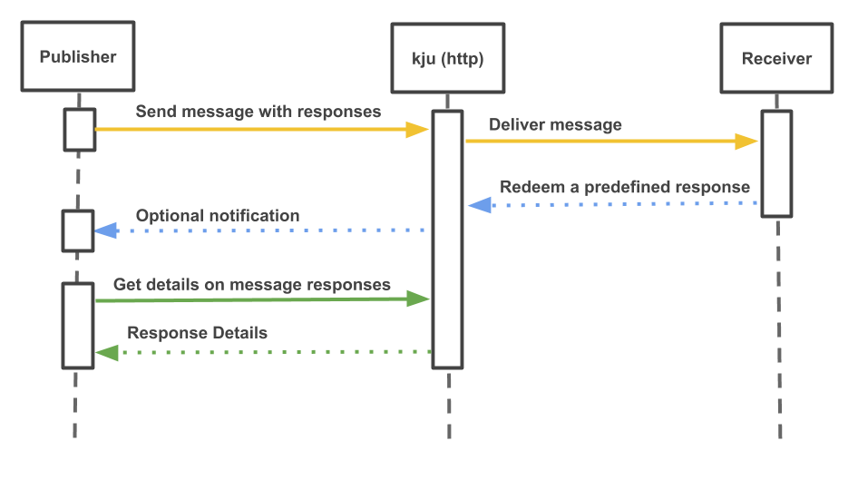

# KJU

kju is a serverless, open communication platform that works on a simple `request <-> response` pattern. The KJU Cloud service is based on the open source kju framework. If you'd like to run it on your system, consider installing the framework on premise.

## Integrate

Consuming the service can be done via simple HTTP calls, using standard tools, like <u>curl</u>, <u>any http client</u>, <u>web browsers</u> and more

## Fundamentals

* Any participator can create a request with a number of predefined responses.
* Any participator can redeem a response for a given request
* Message publishers get get details on message responses



## Tokens

For accessing the service, kju works with tokens. Basically there are two types of tokens:

| Token | Purpose | How to get |
| ----- | ------------| ---------- |
| ***createToken*** | Used for creating messages | Can be generated with the `/creationTOken` Endpoint.
| ***consumerToken*** | Used for redeeming responses for a given message | Will be returned when a message is created |

## Message Anatomy

Messages, when created, can have the following properties:

```json
{
	"content": "message content...",
	"messageTag": "(optional): A tag that can be used for grouping messages on the /messages endpoint",
	"responses": [
		{
			"title": "The title of the response"
		},
		"Can be an object, like above, or just a string"
	]
}
```

# API

> 👍 For easy adoption and embedding into any system, kju works on some simple but versatile concepts. There are only a small number of API endpoints that do the job.

> 🔑 For <u>Authentication</u>, kju doesn't rely on annoying registration and login procedures. Instead, a token-based authentification methodology is used. In order to create messages, one must create a token (one-time) first. This token can then be used to create messages. Tokens for viewing and redeeming responses are bound to specific messages and will be generated and returned when a message is created.


The API (alpha version!) is available under:

`http://europe-west3-spoocloud-202009.cloudfunctions.net/kju-dummy/api`

## GET a token

Generates a token for creating a message

```
Endpoint: /api/creationToken
Method: POST
Returns:
{
	data: "TOKEN"
}
```

## CREATE a message

Creates a message in the kju platform and returns the neccessary tokens for viewing and redeeming responses.

```
Endpoint: /api/message?token=XXX
Method: POST
Query Params: token
Data:
{
	content: "",
	responses: [{

	}]
}
Returns:
{
	_id: "auto generated id",
	content: "",
	responses: [{

	}]
}
```

## SEE a message

Returns a raw message.

> When opened in the browser, a UI will be rendered.

```
Endpoint: /api/message/:messageId?token=XXX
Method: GET
Query Params: token
Returns:
{
	_id: "auto generated id",
	content: "",
	responses: [{

	}]
}
```

## REDEEM a response

Webhook for redeeming a predefined response for a given message

```
Endpoint: /api/message/:messageId/response/:responseId?token=XXX
Method: GET
Query Params: token
Returns:
{
	msg: "ok"
}
```

## SEE responses

Returns the redeemed responses for a given message

> When opened in the browser, a UI will be rendered.

```
Endpoint: /api/message/:messageId/responses?token=XXX
Method: GET
Query Params: token
Returns:
[
	{
		_id: "auto generated id",
		response: "responseId",
		timestamp: "ISO-8601"
	}
]
```
