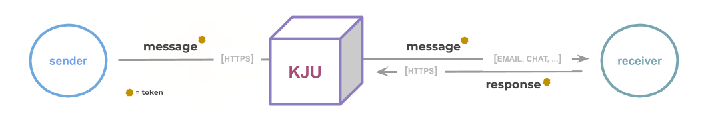

# KJU Basics

kju is a serverless, open communication platform that works on a simple `request <-> response` pattern. The KJU Cloud service is based on the open source kju framework. If you'd like to run it on your system, consider installing the framework on premise.



## Integrate

> Consuming the service can be done via simple HTTP calls, using standard tools, like <u>curl</u>, <u>any http client</u>, <u>web browsers</u> and more

## Custom Hosting

If you are looking to host your own KJU environment, you can use the open source [KJU Framework](https://github.com/kju-org/kju).

## Tokens

For accessing the service, kju works with tokens. Basically there are two types of tokens:

| Token | Purpose | How to get |
| ----- | ------------| ---------- |
| ***personalToken*** | Used for creating messages | Can be generated with the `/personalToken` Endpoint.
| ***consumerToken*** | Used for redeeming responses for a given message | Will be returned when a message is created |

## Message Anatomy

Messages, when created, can have the following properties:

```javascript
{
	"content": "message content...",
	"messageTag": "(optional): A tag that can be used for grouping messages on the /messages endpoint",
	"responses": [
		{
			"title": "The title of the response"
		},
		"Can be an object, like above, or just a string"
	],
	"reciever": "(optional) email reciever"
}
```